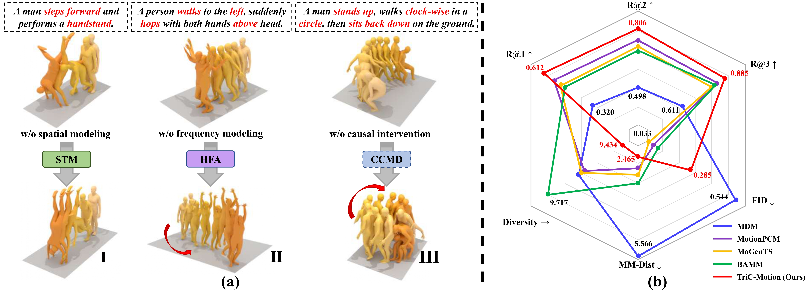

# TriC-Motion: Tri-Domain Causal Modeling Grounded Text-to-Motion Generation (ICLR 2026)



[](https://caoyiyang1105.github.io/TriC-Motion/)[](https://arxiv.org/abs/2602.08462v1)

## ⚙️ Getting Started

### 1. Conda Environment

```shell
conda env create -f environment.yml
```

We tested our code on `Python 3.9.12` and `PyTorch 1.10.0+cu111`.

### 2. Pre-trained Models and Dependencies

### Download Dependencies

```shell
bash prepare/download_glove.sh
bash prepare/download_smpl_files.sh
bash prepare/download_t2m_evaluator.sh
```

### Download Pre-trained Models

```shell
bash prepare/download_models.sh
```

### 3. Obtain Data

**HumanML3D** - Follow the instruction in [HumanML3D](https://github.com/EricGuo5513/HumanML3D.git), then copy the dataset to your data folder:

```shell
cp -r ./HumanML3D/ dataset/HumanML3D
```

**SnapMoGen** - Download the data from [huggingface](https://huggingface.co/datasets/Ericguo5513/SnapMoGen), then place it in the following directory:

```shell
cp -r ./SnapMoGen dataset/SnapMoGen
```

## 🏃 Generation

### (a) Generate with single textual instruction

```python
python -m sample.generate --model_path ./save/tric_motion_L/model.pt --text_prompt "A person jumps up then waits for a bit and then walks forwards."
```

### (b) Generate from a prompt file

```python
python -m sample.generate --model_path ./save/tric_motion_L/model.pt --input_text ./assets/example_text_prompts.txt
```

## 📖 Evaluation

### HumanML3D

```python
python -m eval.eval_humanml --model_path ./save/tric_motion_model_humanml/model000800000.pt
```

## 🍀 Acknowledgments

This code is standing on the shoulders of giants, we would like to thank the following contributors that our code is based on:

[guided-diffusion](https://github.com/openai/guided-diffusion), [MotionCLIP](https://github.com/GuyTevet/MotionCLIP), [text-to-motion](https://github.com/EricGuo5513/text-to-motion), [MDM](https://github.com/GuyTevet/motion-diffusion-model/tree/main) and [MoGenTS](https://github.com/weihaosky/mogents).

## 👍 Citation

```txt
@inproceedings{Cao2026TriCMotionTC,
  title={TriC-Motion: Tri-Domain Causal Modeling Grounded Text-to-Motion Generation},
  author={Yiyang Cao and Yunze Deng and Ziyu Lin and Bin Feng and Xinggang Wang and Wenyu Liu and Dandan Zheng and Jingdong Chen},
  year={2026},
  url={https://api.semanticscholar.org/CorpusID:285454295}
}
```